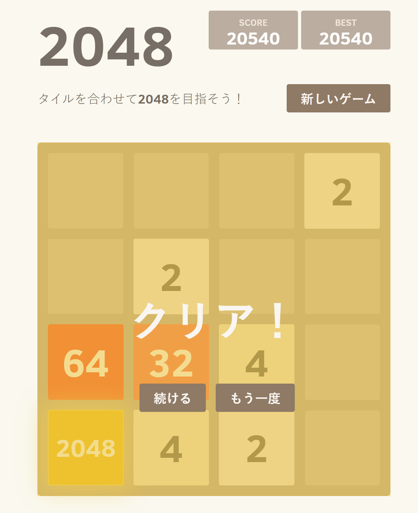

# 2048 Puzzle Game / 2048 パズルゲーム

A Japanese-optimized version of the 2048 game, playable at [2048game](https://especially43.github.io/2048-game-ja/)

日本語に最適化された2048パズルゲーム、[2048game](https://especially43.github.io/2048-game-ja/) で遊べます！

This project is forked from [gabrielecirulli/2048](https://github.com/gabrielecirulli/2048) and optimized for Japanese users.

## Features / ゲームの特徴

- Completely free to play, no registration required
- Compatible with smartphones, tablets, and PCs
- Full Japanese language support
- Playable offline
- Simple touch and keyboard controls

---

- 完全無料で遊べる！会員登録不要！
- スマートフォン、タブレット、PCに対応
- 日本語対応で簡単操作
- オフラインでも遊べる

## Screenshot / スクリーンショット

  

A real victory screenshot from the game! / 実際にプレイして2048を達成したスクリーンショットです！

## How to Play / 遊び方

1. Use arrow keys to move the tiles
2. When two tiles with the same number touch, they merge into one
3. Combine tiles to reach 2048!

---

1. 矢印キーを使ってタイルを動かします
2. 同じ数字のタイルが触れると、1つのタイルに合体します
3. タイルを合体させて、「2048」を目指しましょう！

## Technical Specifications / 技術仕様

- Frontend: HTML5, CSS3, JavaScript
- Responsive design
- PWA support (planned)

## License / ライセンス

MIT License

## Contact / お問い合わせ

For bug reports or feature requests, please create an issue on GitHub.
バグ報告や機能改善のご要望は、GitHubのIssueでお願いします。
